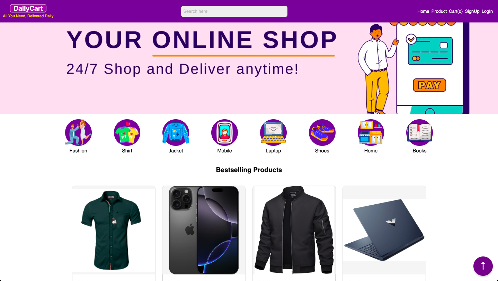
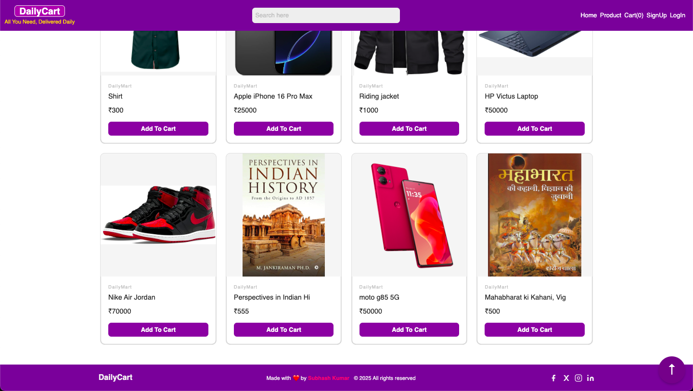
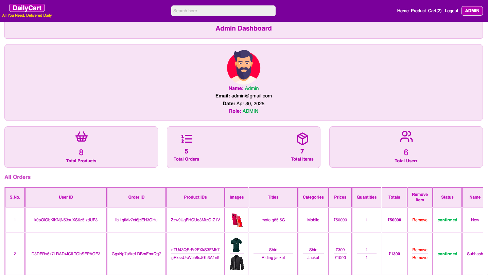

# 🛍️ DailyCart

**DailyCart** is a modern, full-featured e-commerce web application built with **ReactJS** and **Firebase**. It supports user authentication, product browsing, cart management, admin control, and real-time order tracking.

 <!-- Replace with actual image path -->

---

## 🚀 Features

- 🔐 Firebase Authentication (Login / Signup / Role-based access)
- 🛒 Add to Cart, Quantity Update, and Cart Sync
- 📦 Firestore for Products, Orders, and Users
- 🧾 Order Placement with Address & Payment Info
- 👨‍💼 Admin Dashboard to Manage Products and Orders
- 📱 Responsive UI (Mobile-friendly)
- 🧹 Clean UI using TailwindCSS
- 🌐 Deployment-ready with Netlify / Firebase Hosting

---

## 📸 Screenshots

| Homepage                      | Product Detail                 | Admin Dashboard              |
|------------------------------|--------------------------------|------------------------------|
|    |       |       |

> Place your actual screenshot images in the `public/` folder and update the filenames accordingly.

---

## ⚙️ Tech Stack

- **Frontend**: React + Vite + TailwindCSS
- **Backend**: Firebase Firestore
- **Authentication**: Firebase Auth
- **Deployment**: Netlify / Firebase Hosting

---

## 🧑‍💻 Getting Started

### Clone the project

```bash
git clone https://github.com/SubhashKumar8574/DailyCart.git
cd DailyCart
